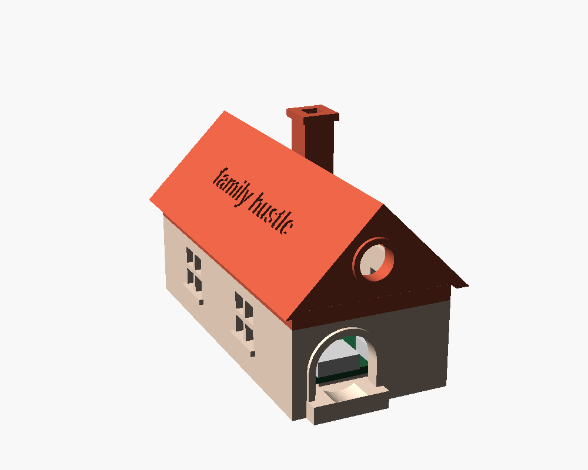
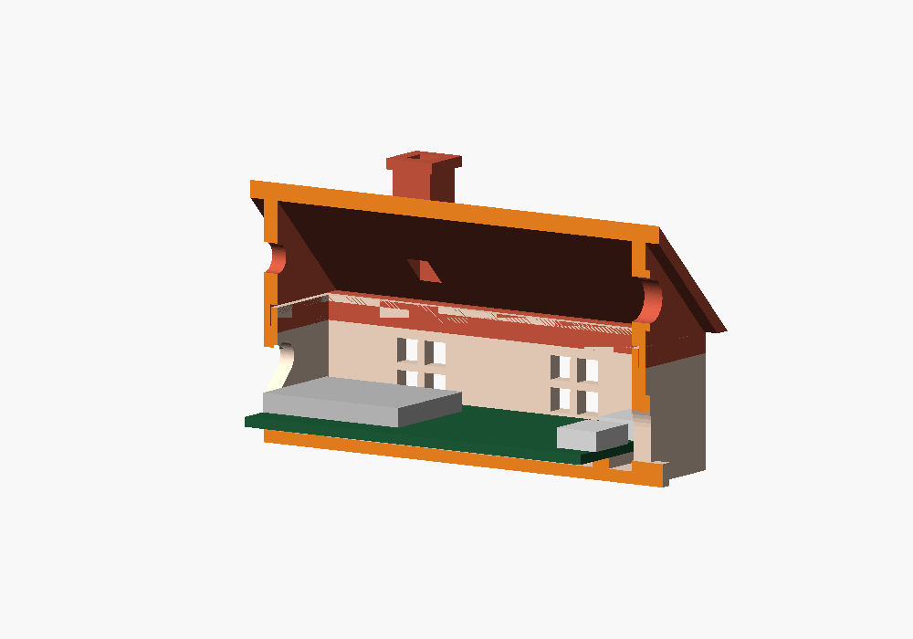

# A little house for the sync box



The family's data lives in it, so it's a house:
- the USB cable comes in through the **front door**, up the porch steps
- the board's RGB LED glows warm through the **round attic window** while the box is ready, and flashes when a phone saves (see [the light](../README.md#the-light))
- the four-pane **side windows**, the **chimney** and the **heart** in the back wall are the vents
- "family hustle" is engraved on the roof

It's about 39 × 75 × 46 mm, a little smaller than a deck of cards, and it comes in two parts:

| part | prints | about |
| --- | --- | --- |
| `body` | standing on its floor | 36 × 75 × 22 mm |
| `roof` | standing on its open bottom | 39 × 77 × 27 mm |

Neither needs supports. The roof is pitched at 45° for exactly that reason.



Inside, the board sits on two ribs between its rows of pins, and a stop behind it takes the push when the cable goes in. The port you don't use gets a shallow pocket inside the front wall, because it sticks out past the board's edge and would stop the board sitting flat against the wall. The roof slips over a lip at the top of the walls, so it needs no screws.

## Measure your board first

The defaults are for the **black ESP32-S3 N16R8 board with two USB-C ports** (the one with "USB-JTAG" printed beside its RGB LED), **without pin headers soldered on**. Boards sold as "N16R8" vary, so check these with a ruler or calipers and change them at the top of `house.scad`:

| setting | what | default |
| --- | --- | --- |
| `board_l` | end to end, including the ports and the antenna if they stick out | 63.0 |
| `board_w` | width | 28.0 |
| `under` | room under the board; **9.5** if it has pins soldered on | 3 |
| `usb_x` | how far the port **you plug into** is from the board's centre line, in mm, + to the right looking at the port end with the components up | −6.0 |
| `other_usb_x` | the same for the port you don't use; 0 if there's only one | 6.0 |

`usb_x` matters most, because the door only has room for one plug. Use the port the box was flashed through: on this board that's the **left** one, the ESP32's own USB ("Pass-Through Type-C USB & OTG"), not the USB-to-serial one on the right. On an Espressif DevKitC-1 it's the one labelled **USB**, not UART.

## Print

```bash
openscad -D 'part="body"' -o body.stl house.scad
openscad -D 'part="roof"' -o roof.stl house.scad
```

PLA is fine; the board runs warm, not hot. Use a 0.2 mm layer height and a 0.4 mm nozzle, with no supports and no brim. Print each part the way it comes out of OpenSCAD: the body on its floor, the roof on its open bottom.

A lighter colour for the roof lets the LED glow through it as well as the window.

## Put it together

1. Lower the board in, pins down, with the USB port towards the door, and slide it forward until the port sits in the doorway.
2. Plug the cable in through the door.
3. Press the roof on.

If the roof is too tight, raise `lid_gap` by 0.05 and print the roof again. If it's too loose, lower it. The body doesn't need reprinting.
